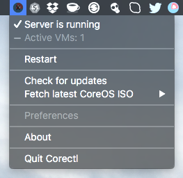

Corectl App for macOS 
========================

**Corectl App** is a macOS Status bar App which works like a wrapper around the [corectl](https://github.com/TheNewNormal/corectl) command line tool `corectld` to control the server runtime process.

**Note:** `Corectl App` only controls `corectld` server daemon, and is very, very, light on macOS system resources, when running and when idle. Also if there are no VMs running `corectld` server daemon is not using much resources too.

[corectl](https://github.com/TheNewNormal/corectl) allows to run CoreOS VMs on macOS using native macOS Hypervisor framework which eliminates any needs to use Virtual Box or any other similar virtualisation software.

How to install Corectl App for macOS
----------

**Requirements**
 -----------
  - **macOS 10.10.3** Yosemite or later 
  - Mac 2010 or later for this to work.
  - There should be nothing else hogging port 53, as `corectld` comes with inbuilt DNS server, which allows easier setup of CoreOS VMs.

####Download:
* Download `corectl_app.dmg` from the [Releases Page](https://github.com/TheNewNormal/corectl.app/releases)

###Install:

Open the downloaded `DMG` file and drag the App to /Applications, and start the `Corectl` from there.

Everytime you start App will be asked for your Mac user password, which will used to start `corectld` server as `root` is needed for the network to work.

How it works
------------
When you start `Corectl` app, you will find a small icon with the CoreOS logo with X (X means [xhyve](https://github.com/mist64/xhyve)) in the Status Bar.

- Local Docker registry runs on `192.168.64.1:5000` and images are stored under `~/.coreos/registry/` and it can be shared between all VMs.

Under menu you will be able:

- To see that Server is running
- Shows Server version
- Shows Active VMs
- Restart the server
- Check for new App version
- Check and download `corectl` new version
- Fetch latest CoreOS ISO images, which will be stored under `~/.coreos/images` folder and can be shared between all VMs.

### have fun!

## Projects using **Corectl.App**

- [TheNewNormal](http://github.com/TheNewNormal) org projects:

  - **[CoreOS VM for macOS](https://github.com/TheNewNormal/coreos-osx)**
  - **[Kubernetes Solo Cluster for macOS](https://github.com/TheNewNormal/kube-solo-osx)**
  - **[Multi node Kubernetes Cluster for macOS](https://github.com/TheNewNormal/kube-cluster-osx)**

## Contributing

**Corectl App** is an [open source](http://opensource.org/osd) project release under
the [Apache License, Version 2.0](http://opensource.org/licenses/Apache-2.0),
hence contributions and suggestions are gladly welcomed! 
